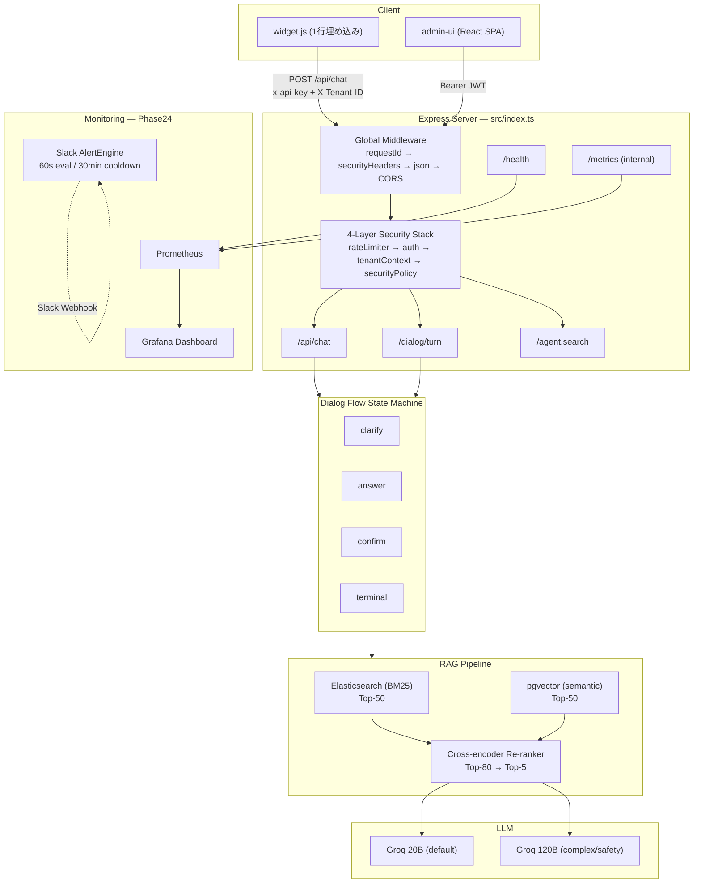
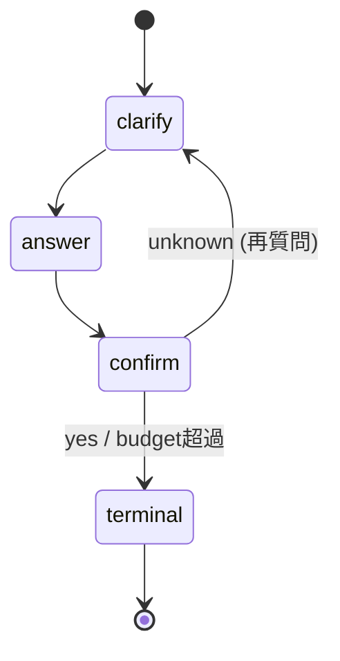

# RAJIUCE Architecture

## System Overview



## Request Flow

```
Browser (widget.js on partner site)
  │
  ▼ POST /api/chat  { message, conversationId, history }
  │  Headers: x-api-key, X-Tenant-ID, Content-Type
  │
  ├─ [Global] requestIdMiddleware
  ├─ [Global] securityHeadersMiddleware
  ├─ [Global] express.json({ limit: "1mb" })
  ├─ [Global] corsMiddleware  ← OPTIONS preflight はここで 204 応答
  │
  ├─ [Stack] rateLimiter      ← IP/anon key ベースの DDoS 防御
  ├─ [Stack] authMiddleware    ← JWT / x-api-key / Basic → tenantId 解決
  ├─ [Stack] tenantContext     ← TenantConfig をロード
  ├─ [Stack] securityPolicy    ← テナント別 origin 検証
  │
  ▼ createChatHandler
  │
  ├─ Zod バリデーション
  ├─ runDialogTurn()
  │   ├─ Multi-Step Planner (rule-based / LLM)
  │   ├─ SalesFlow (clarify → propose → recommend → close)
  │   ├─ Dialog Orchestrator
  │   │   ├─ RAG: ES + pgvector → Cross-encoder rerank
  │   │   └─ Answer: Groq 20B/120B
  │   └─ Flow State Machine (clarify → answer → confirm → terminal)
  │
  ▼ Response: { data: { id, role, content, timestamp, tenantId } }
```

## Widget Embed (public/widget.js)

パートナーサイトに 1 行で埋め込む:

```html
<script src="https://api.example.com/widget.js"
        data-tenant="TENANT_ID"
        data-api-key="API_KEY"
        async></script>
```

- Shadow DOM でホストサイトの CSS から隔離
- innerHTML 禁止 — textContent / createElement のみ
- postMessage で event.origin を検証
- prefers-reduced-motion 対応
- タッチターゲット 44px 以上 / フォント 16px 以上

## Authentication (src/agent/http/authMiddleware.ts)

認証パス（優先順）:
1. **Bearer JWT** → tenantId は payload.tenant_id から取得
2. **x-api-key** → SHA-256 ハッシュ → DB lookup → tenantId
3. **Basic Auth** → DEPRECATED（移行期間のみ）

tenantId は **JWT/API Key からのみ** 取得。req.body.tenantId は禁止。

## RAG Hybrid Search

```
Query
  ├─ Elasticsearch BM25  → Top-50
  ├─ pgvector semantic   → Top-50
  └─ 結合/重複排除       → Top-80
      └─ Cross-encoder Re-rank → Top-5
          └─ ragExcerpt.slice(0, 200) 適用
```

- k_semantic=50, k_bm25=50, k_final=5, max_context_tokens=2000
- CE エンジン: ONNX / dummy / heuristic (フォールバック)

## Model Routing (20B / 120B)

| 条件 | ルート |
|---|---|
| デフォルト | 20B |
| context_tokens > 2000 | 120B |
| recall < 0.6 | 120B |
| complexity ≥ τ | 120B |
| safetyTag ∈ {legal, security, policy, violence} | 120B (必須) |
| requiresSafeMode = true | 120B |

フォールバック: 20B 失敗 → 120B → 静的 FAQ → HITL

## Dialog Flow State Machine (Phase22)



- ループ検出: sameStateRepeats / clarifyRepeats / confirmRepeats
- Budget: maxConfirmRepeats (env: PHASE22_MAX_CONFIRM_REPEATS)
- 終了理由: completed / loop_abort / kill_switch / timeout / error / aborted_budget

## SalesFlow Pipeline

```
detectSalesIntents(userMessage, history)
  │
  ├─ Clarify  → 不足情報のヒアリング質問生成
  ├─ Propose  → 体験レッスン提案
  ├─ Recommend → レベル別コース推薦
  └─ Close    → 次のアクション確認
```

- intent 自動検出（ルールベース + YAML 設定）
- SalesSessionMeta でステージを永続化
- SalesFlow の結果が answer を上書き可能

## Fast-path (Planner Skip)

以下を満たす場合、Planner LLM を省略して RAG → Answer のみで応答:
- history.length > 0
- intent ∈ {shipping, returns, payment, product-info}
- テキスト長 ≥ 15
- safety なし

2 ターン目の p50: 1.3〜1.8s

## Phase24: Monitoring & Alerting

### Prometheus Metrics (src/lib/metrics/)

| メトリクス | 種類 | ラベル |
|---|---|---|
| rajiuce_conversation_terminal_total | Counter | reason, tenantId |
| rajiuce_loop_detected_total | Counter | tenantId |
| rajiuce_avatar_requests_total | Counter | status, tenantId |
| rajiuce_rag_duration_ms | Histogram | phase, tenantId |
| rajiuce_http_errors_total | Counter | statusCode, tenantId |
| rajiuce_kill_switch_active | Gauge | reason |
| rajiuce_active_sessions | Gauge | tenantId |

- `/metrics` は X-Internal-Request: 1 ヘッダー必須
- `/health` は ES / PG / CE の疎通チェック (2 秒タイムアウト)

### AlertEngine (src/lib/alerts/)

60 秒周期で KPI を評価、Slack Webhook でアラート送信:

| ルール | 閾値 | レベル | 持続時間 |
|---|---|---|---|
| 会話完了率低下 | < 60% | CRITICAL | 1 時間 |
| ループ検出率上昇 | > 15% | CRITICAL | 30 分 |
| アバター FB 率上昇 | > 50% | WARNING | 15 分 |
| 検索 p95 上昇 | > 2000ms | WARNING | 10 分 |
| エラー率上昇 | > 3% | CRITICAL | 5 分 |
| Kill Switch 発動 | active | INFO | 即時 |

- cooldown: 同一アラートの再送は 30 分間隔
- RESOLVED 通知対応
- SLACK_WEBHOOK_URL 未設定時はサイレントスキップ

### Grafana + Prometheus (infra/)

```
infra/
├── docker-compose.monitoring.yml
├── prometheus/prometheus.yml          # 15秒スクレイプ
└── grafana/
    ├── provisioning/
    │   ├── datasources/prometheus.yml
    │   └── dashboards/dashboard.yml
    └── dashboards/rajiuce-overview.json  # 6パネル
```

## TenantConfig & SLA

```typescript
interface TenantConfig {
  tenantId: string;
  name: string;
  plan: "starter" | "growth" | "enterprise";
  features: { avatar: boolean; voice: boolean; rag: boolean };
  security: {
    apiKeyHash: string;
    hashAlgorithm: "sha256";
    allowedOrigins: string[];
    rateLimit: number;
    rateLimitWindowMs: number;
  };
  enabled: boolean;
  sla?: TenantSla;
}

interface TenantSla {
  completionRateMin: number;   // default 70%
  loopRateMax: number;         // default 10%
  fallbackRateMax: number;     // default 30%
  searchP95Max: number;        // default 1500ms
  errorRateMax: number;        // default 1%
}
```

## Admin UI (admin-ui/)

React SPA — Supabase JWT 認証:
- `/admin` — 管理ダッシュボード
- `/admin/knowledge` — AI ナレッジ（PDF）管理
- `/admin/monitoring` — KPI 監視ダッシュボード (30 秒ポーリング)
- `/faqs` — FAQ 一覧 / 作成 / 編集

## Environment Variables

```bash
# Server
PORT=3000
LOG_LEVEL=info

# Data
ES_URL=http://localhost:9200
DATABASE_URL=postgres://...
HYBRID_TIMEOUT_MS=300
HYBRID_MOCK_ON_FAILURE=1

# Auth
AGENT_API_KEY=
AGENT_BASIC_USER=          # DEPRECATED
AGENT_BASIC_PASSWORD=       # DEPRECATED
ALLOWED_ORIGINS=http://localhost:8080

# Tenant
API_KEY_TENANT_ID=
BASIC_AUTH_TENANT_ID=

# CE
CE_MODEL_PATH=
CE_ENGINE=                  # onnx / dummy

# Monitoring
SLACK_WEBHOOK_URL=

# Flow
PHASE22_MAX_CONFIRM_REPEATS=2
DEFAULT_TENANT_ID=english-demo
```

## Performance Targets

| メトリクス | ターゲット |
|---|---|
| 1 ターン目 (Clarify) | p50: 1.7s, p95: 2.7s |
| 2 ターン目 (fast-path) | p50: 1.3s, p95: 1.8s |
| Safety (120B) | p50: 2.7s, p95: 4.0s |
| 120B 比率 | ≤ 10% |
| エラー率 | < 0.5% |
| コスト | 月 $27-48 |

## Directory Structure

```
src/
├── api/chat/route.ts              # /api/chat ハンドラ
├── agent/
│   ├── dialog/                    # DialogAgent, FlowContext, types
│   ├── flow/                      # DialogOrchestrator, MultiStepPlanner
│   ├── http/                      # authMiddleware, AgentDialogOrchestrator
│   ├── orchestrator/
│   │   ├── langGraphOrchestrator.ts
│   │   └── sales/                 # SalesFlow, IntentDetector, Rules
│   └── tools/                     # searchTool
├── search/
│   ├── hybrid.ts                  # ES + pgvector 並列検索
│   ├── rerank.ts                  # Cross-encoder re-rank
│   └── ceEngine.ts                # CE エンジン管理
├── lib/
│   ├── cors.ts                    # CORS (global)
│   ├── rate-limit.ts              # Rate limiting
│   ├── security-policy.ts         # Per-tenant policy
│   ├── tenant-context.ts          # TenantConfig loader
│   ├── health.ts                  # /health endpoint
│   ├── metrics/                   # Prometheus metrics
│   │   ├── kpiDefinitions.ts
│   │   ├── metricsCollector.ts
│   │   └── promExporter.ts
│   └── alerts/                    # Slack alerting
│       ├── alertEngine.ts
│       ├── alertRules.ts
│       └── slackNotifier.ts
├── admin/http/                    # Admin API routes
└── types/contracts.ts             # TenantConfig, TenantSla, etc.
public/
└── widget.js                      # 1行埋め込みウィジェット
admin-ui/                          # React SPA
infra/                             # Grafana + Prometheus
types/
└── contracts.ts                   # Shared type definitions
```
