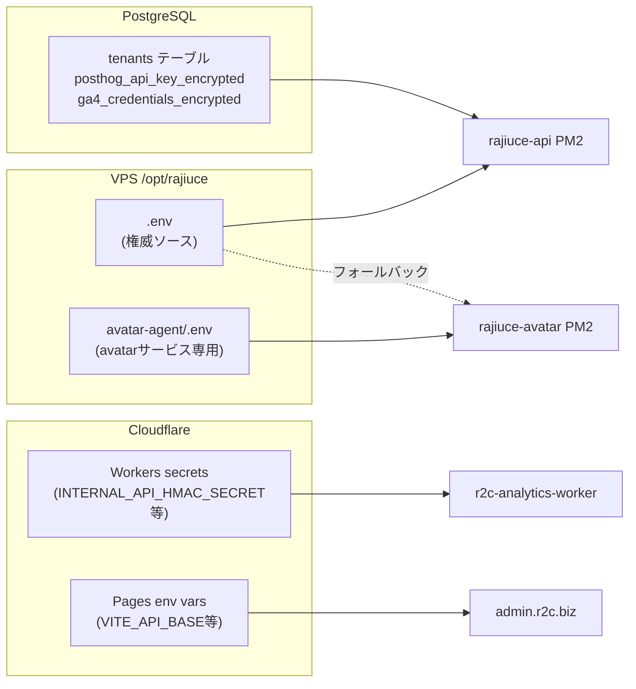

# R2C インフラ安定性監査 2026-04-21

**監査日**: 2026-04-21  
**調査者**: Claude Code (Sonnet 4.6)  
**方針**: read-only 調査 + 計画書作成のみ（実装なし）  
**ブランチ**: `feat/infra-audit-2026-04-21`

---

## エグゼクティブサマリー

「ちょっと違うことするとバグやエラー出る」状態の根本原因を 5 領域で調査した。
構造的問題は **デプロイフロー設計** と **avatar-agent の依存管理** に集中しており、
設定管理・テストカバレッジは軽微な改善余地がある程度で緊急性は低い。

| 深刻度 | 領域 | 根本原因 |
|---|---|---|
| 🔴 Critical | デプロイフロー | `docs/investigation/` が rsync でVPSに転送 → Guard 4-B 毎回ブロック |
| 🔴 Critical | avatar-agent | livekit-agents のワーカープール仕様 + venv 毎回全再構築 の二重問題 |
| 🟡 High | 依存関係 | `requirements.txt` バージョン未固定（>= のみ）→ pip install ごとに変わる |
| 🟡 High | 設定管理 | 設定が 4 箇所に分散し、env-check.sh の検査範囲が Node.js のみ |
| 🟢 Medium | E2E テスト | 1159 テストは pass だが本番環境相当での実行なし |

---

## A. avatar-agent 安定性

### A-1. restart 237回/64分 の原因

livekit-agents は **Worker Pool アーキテクチャ** を採用しており、各 Job（LiveKit ルーム接続）の終了ごとにワーカープロセスを draining → shutdown → restart するのが**設計上の仕様**。

```
[Process lifecycle]
  worker start
    └─ Job accepted (entrypoint called)
         └─ Room disconnected or timeout
              └─ draining worker
                   └─ shutting down worker   ← PM2 restart カウント++
                        └─ worker restart
```

237回/64分（3.7回/分）は「1分に3〜4回の LiveKit セッション終了 or 外部API呼び出し失敗」と対応している可能性が高い。
**PM2 の `restart` カウントは「プロセス再起動」を数えるため、正常な Worker lifecycle でも増加する。**

ただし「正常 lifecycle 再起動」と「クラッシュ再起動」の区別が PM2 logs だけでは困難。

### A-2. ecosystem.config.cjs の設定値分析

```javascript
// 現状 (ecosystem.config.cjs)
max_restarts: 10,       // クラッシュ再起動の上限（低い）
restart_delay: 5000,    // 5秒待機
```

**問題**: `max_restarts: 10` は「クラッシュ」による再起動限界。livekit-agents の正常 lifecycle 再起動もクラッシュと区別されず、このカウントに含まれる可能性がある（PM2 バージョン依存）。実質的に 10 回の lifecycle 後に PM2 が "errored" 状態になるリスクがある。

### A-3. venv 毎回全再構築

`deploy-vps.sh` のステップ [3.5/5]:

```bash
python3 -m venv venv && source venv/bin/activate && pip install --upgrade pip -q && pip install -r requirements.txt -q
```

- `venv` は rsync 除外対象 (`--exclude 'avatar-agent/venv/'`)
- デプロイのたびに `venv` を**ゼロから再構築**
- `requirements.txt` が 6 パッケージ（livekit-agents のみで 30+ 依存を引く）→ pip install に数分かかる
- venv 消失の直接原因: rsync --delete が venv/ を削除したのではなく、前回の venv 構築途中で失敗した場合に半壊した venv が残る

### A-4. requirements.txt バージョン未固定

```
livekit-agents[lemonslice,openai]>=1.4.0   # >= のみ → pip が最新を取ってくる
fish-audio-sdk>=1.0.0
groq>=0.11.0
httpx>=0.27.0
python-dotenv>=1.0.0
aiohttp>=3.9.0
```

**問題**:
- pip install 実行のたびに最新バージョンが取得される
- livekit-agents はアクティブ開発中でマイナーバージョン間で破壊的変更あり（v1.4 → v1.5 等）
- 4/19 と 4/21 の venv 消失→再構築時に異なるバージョンが入った可能性がある

### A-5. Silero VAD 除外の影響

```python
# agent.py コメント
# NOTE: Silero VAD は除外（VPS に GPU/CUDA/libva-drm がないため SIGABRT でクラッシュ）
```

- `LIBVA_DRIVER_NAME=dummy` で回避済み
- ただし VAD なしでは音声検出精度が低下する（livekit-agents のデフォルト WebRTC VAD にフォールバック）

### A-6. 外部 API 依存チェーン

```
ユーザー接続
  └─ Fish Audio API (TTS, 30秒タイムアウト)
  └─ Lemonslice API (Avatar rendering)
  └─ Groq API (LLM, 15秒タイムアウト)
```

いずれかの API が遅延・障害を起こすと例外が発生し、PM2 の restart カウントが増える。
各 API のエラーハンドリングは実装されているが（`FALLBACK_MSG` 返却等）、接続レベルの障害はプロセスごと落とす。

---

## B. 設定管理

### B-1. 設定の 4 箇所分散マップ



### B-2. env-check.sh の検査範囲の穴

`SCRIPTS/env-check.sh` は `src/` の `process.env.*` を検出するが:

| 検出できる | 検出できない |
|---|---|
| `src/**/*.ts` の `process.env.*` | `avatar-agent/agent.py` の `os.environ[]` |
| | `cloudflare-workers/` の `env.*` |
| | `admin-ui/` の `import.meta.env.*` |

→ Python側で使用する `LEMONSLICE_API_KEY`, `FISH_AUDIO_API_KEY` 等は env-check.sh の範囲外。
POSTHOG_* 系設定漏れが発生した理由の一端。

### B-3. .env ファイル分散状況（ローカル）

```
.env                   → gitignore（ローカル開発用）
.env.local             → gitignore
.env.production        → gitignore
.env.bak               → 存在確認（gitignore対象か不明）
avatar-agent/.env.example → gitignore なし（git追跡対象）
```

`.env.bak` の存在は過去の「バックアップ」操作の痕跡。定期的に削除が必要。

### B-4. Cloudflare Pages の VITE_* 管理

Admin UI は Cloudflare Pages で自動デプロイされ、環境変数は Cloudflare Dashboard で管理。
`VITE_API_BASE` の変更はダッシュボードのみで可能で、コードで確認できない。
→ 設定変更の監査証跡がない。

---

## C. デプロイフロー

### C-1. 🔴 Guard 4-B 毎回ブロックの根本原因

```bash
# deploy-vps.sh Guard 4-B
UNCOMMITTED=$(ssh "${VPS}" "cd ${REMOTE_DIR} && git status --porcelain 2>/dev/null | wc -l")
if [ "${UNCOMMITTED}" -gt 0 ]; then
    echo "🛑 Aborting deploy. VPS has local modifications..."
    exit 1
fi
```

**問題のメカニズム**:

1. ローカルに `docs/investigation/` ディレクトリが存在（git では untracked）
2. rsync は `docs/investigation/` を明示的に除外していない
3. rsync が `docs/investigation/` を VPS に転送
4. VPS の `/opt/rajiuce` は `.git/` ディレクトリを保持（初期 `git clone` 由来）
5. VPS で `git status --porcelain` を実行 → `docs/investigation/` が `??` (untracked) として表示
6. Guard 4-B が `0 より大きい` と判定 → **デプロイ停止**

`git status --porcelain` の出力:
```
?? docs/investigation/
```

これが「毎回 untracked files ガード停止」の正体。

### C-2. rsync 除外対象と実際の除外ファイル

```bash
rsync --exclude 'node_modules/' \
      --exclude '.pnpm-store/' \
      --exclude 'dist/' \
      --exclude 'admin-ui/node_modules/' \
      --exclude 'admin-ui/dist/' \
      --exclude '.env' \
      --exclude '.env.*' \
      --exclude '.git/' \
      --exclude 'logs/' \
      --exclude '*.log' \
      --exclude '*.zip' \
      --exclude '_bundle/' \
      --exclude '.DS_Store' \
      --exclude '.vscode/' \
      --exclude '.devcontainer/' \
      --exclude '__pycache__/' \
      --exclude 'avatar-agent/venv/'
```

**除外されていないが VPS に不要なもの**:
- `docs/investigation/` （git untracked → Guard 4-B ブロック原因）
- `.wolf/` （OpenWolf ローカルファイル）
- `SCRIPTS/*.sh` のうち開発用スクリプト
- `*.md` 系ドキュメント（VPS 上では不要だが害はない）

`.wolf/` は `.gitignore` 登録済みのため、VPS の git status には表示されない（git管理外）。
→ `.wolf/` は rsync で転送されているが Guard をブロックしない。

### C-3. VPS の git 状態管理

VPS `/opt/rajiuce` は git clone で初期化されており、`.git/` が保持されている。
rsync は `.git/` を除外対象としているため、VPS の git 履歴は初期 clone 時点から更新されない。

**実態**:
- VPS の `git log` は初期 clone 時点のまま
- VPS の `git status` は「rsync で転送されたが git HEAD にない全ファイル」を modified/untracked として表示
- Guard 4-B が保護するのは「VPS 上での手動編集」だが、仕組み上 rsync による差分も検出してしまう

### C-4. venv 再構築コスト

```
デプロイ所要時間の内訳（推定）:
  Step [1/5] rsync:          30秒〜2分
  Step [2/5] pnpm install:   1〜3分（frozen-lockfile で高速化済み）
  Step [3/5] pnpm build:     1〜2分
  Step [3.5/5] venv rebuild: 2〜5分（毎回0から）← ここが遅い
  Step [4/5] pm2 restart:    10秒
  Step [5/5] nginx reload:   5秒
  合計:                      5〜13分
```

venv を「変更がある場合のみ再構築」にすれば 2〜5 分短縮できる。

---

## D. 依存関係

### D-1. Node.js (pnpm)

`pnpm-lock.yaml` で全依存が固定されている。`pnpm install --frozen-lockfile` で lockfile に厳格に従う。
**評価: 良好。**

### D-2. Python (pip/requirements.txt)

```
requirements.txt バージョン制約:
  livekit-agents[lemonslice,openai]>=1.4.0   # 下限のみ
  fish-audio-sdk>=1.0.0
  groq>=0.11.0
  httpx>=0.27.0
  python-dotenv>=1.0.0
  aiohttp>=3.9.0
```

`pip install` は lockfile がなければ毎回最新を取得。
`livekit-agents` は extras `[lemonslice,openai]` を含み、30+ の推移的依存を引く。

**問題**: venv 再構築時にバージョンが変わりうる → 「以前は動いていたのに動かない」バグが発生しやすい。

**対策**: `pip freeze > requirements.lock.txt` で固定、または `pip install` に `--no-deps` と明示バージョン指定。

### D-3. Cloudflare Workers (npm)

```bash
npx wrangler secret put INTERNAL_API_HMAC_SECRET
```

Cloudflare Workers は pnpm 非対応のため npm を使用。`wrangler` は `npx` で都度取得。
プロジェクト全体の `package.json` とは独立しており、`pnpm audit` の対象外。
**評価: 現状問題なし。分離されているのは設計的に正しい。**

### D-4. implicit 依存の存在

`livekit-agents[lemonslice,openai]` は extras 経由で:
- `livekit-plugins-lemonslice`
- `livekit-plugins-openai`

を暗黙的に引く。これらのバージョンも固定されていない。

---

## E. 本番 E2E カバレッジ

### E-1. テスト件数と構成

| 種別 | 件数 | 実行環境 |
|---|---|---|
| Jest 単体/統合テスト | 1159 pass（2026-04-21時点） | ローカル / CI |
| Playwright E2E | playwright.config.ts あり | **CI 未統合** |
| post-deploy-smoke.sh | 6 チェック項目 | 手動実行のみ |

### E-2. post-deploy-smoke.sh のカバレッジ

```
✅ カバー済み:
  GET /health          → HTTP 200 + body.status=ok 確認
  GET /widget.js       → HTTP 200 + Content-Type 確認
  GET /admin.r2c.biz   → HTTP 200
  GET /carnation-demo/ → HTTP 200
  GET /metrics         → HTTP 200 (with X-Internal-Request)
  PM2 rajiuce-avatar   → online 確認

❌ カバーされていない:
  POST /api/chat           → 実際のチャット応答テスト
  POST /api/avatar/room-token → アバター機能テスト
  認証エラー (401/403)     → セキュリティ境界テスト
  DB 接続                  → PostgreSQL / Elasticsearch 疎通
  RAG 検索精度             → ベクトル検索結果の品質
```

### E-3. 本番環境相当でのテスト実施状況

`docs/PHASE_A_KNOWN_ISSUES.md` §6 に明記:
> Phase A Day 7 Part A（本番 E2E テスト）の実施待ち  
> Claude Code では実行できず、hkobayashi が手動で確認が必要

**現状**: 本番 API（https://api.r2c.biz）に対する自動 E2E テストは存在しない。

### E-4. CI パイプライン構成

```yaml
# .github/workflows/security-scan.yml のみ確認
# pnpm verify (typecheck + lint + test) を main push / PR / 週次で実行
# ただし Playwright E2E は含まれていない
```

---

## 付録: 発見された構造的問題一覧

| ID | 深刻度 | 領域 | 問題 | 根本原因 |
|---|---|---|---|---|
| INF-01 | 🔴 | Deploy | Guard 4-B が毎回 docs/investigation/ で停止 | rsync 除外リストに docs/investigation/ がない |
| INF-02 | 🔴 | Avatar | restart 237回/64分 (livekit-agents lifecycle + 外部API障害) | Worker Pool 仕様 + max_restarts:10 の混同 |
| INF-03 | 🟡 | Avatar | venv 毎回全再構築（2〜5分のデプロイ遅延） | rsync除外でvenv消える + pip freeze なし |
| INF-04 | 🟡 | Deps | requirements.txt バージョン未固定 | >= のみ、pip.lock相当なし |
| INF-05 | 🟡 | Config | env-check.sh が Python/CF Workers の変数を検査しない | src/*.ts のみ対象 |
| INF-06 | 🟡 | Config | .env.bak が VPS 上に残存している可能性 | バックアップ慣行の副産物 |
| INF-07 | 🟢 | E2E | 本番 E2E テストが手動・未実施 | CI に Playwright smoke が未統合 |
| INF-08 | 🟢 | Deploy | VPS の git 履歴が初期 clone から更新されない | rsync は .git/ を除外するため |

---

*監査日: 2026-04-21 / 前回コード監査: docs/CODE_AUDIT_2026-04-19.md*
