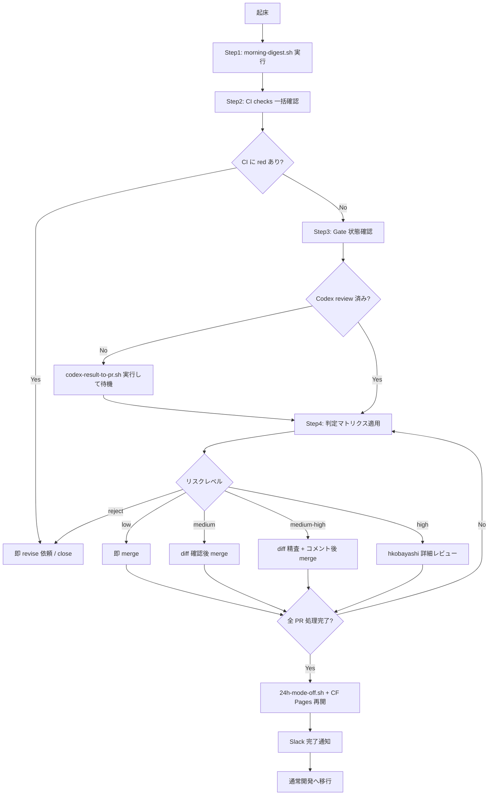

# 朝のレビュー受け入れフロー (Phase70-C)

**バージョン:** 1.0  
**作成日:** 2026-05-20  
**Asana:** Phase70-C (GID: 1214919682909058)  
**目標:** 夜間 CLI 自走 → 翌朝 hkobayashi レビュー完結を **2 時間以内** に収める

---

## 既存 docs との分担（重複回避）

| ファイル | カバー範囲 | 本ドキュメントとの関係 |
|---|---|---|
| `docs/24H_AUTONOMOUS_PLAYBOOK.md §4` | 朝のレビューフロー全体図 (プレースホルダ) | **本ドキュメントで詳細化**、§4 から本ファイルへ参照リンク |
| `docs/PR_MERGE_RULES.md` | merge 操作 (`gh pr merge --auto --squash`) | merge 実行手順は参照のみ、判断基準は本ドキュメントで定義 |
| `docs/R2C_24H_STARTUP_CHECKLIST.md §8` | 24h 1日のリズム・時刻スケジュール | 起動前は参照のみ、**朝以降** の手順が本ドキュメントの管轄 |
| `docs/ASANA_TASK_TEMPLATE.md` | タスク記述規約・Tier 定義 | Tier 定義は参照のみ |
| `SCRIPTS/r2c-morning-report.sh` | cron 06:00 Slack 自動投稿 | 本フローの `Step 1` で出力を読む位置づけ |

---

## 1. 前提条件

朝のレビューを開始する前に確認:

- [ ] `~/.r2c-24h-mode` が存在する（24h 自走モード ON のまま）
- [ ] Slack `#r2c` に自走完了通知が来ている  
- [ ] `gh auth status` で PAT 有効

---

## 2. 受け入れフロー（ステップ詳細）

### Step 1 — 夜間サマリ取得（5 分）

```bash
# morning-digest.sh でナイトサマリ生成 + Slack #r2c 投稿
bash SCRIPTS/morning-digest.sh

# または Slack に既に投稿済みならそちらを参照
gh pr list --search "created:>$(date -d 'yesterday' +%Y-%m-%d 2>/dev/null || date -v-1d +%Y-%m-%d)" \
  --json number,title,headRefName,labels,checks \
  --template '{{range .}}#{{.number}} {{.title}} [{{range .labels}}{{.name}}{{end}}]{{"\n"}}{{end}}'
```

確認ポイント:
- 夜間 PR 件数（目安: 5〜8 本）
- タスクキュー残量（Asana でも確認）

### Step 2 — CI / checks 結果一括確認（5 分）

```bash
# 各 PR の CI status 確認
for pr in $(gh pr list --json number -q '.[].number' | head -10); do
  echo "=== PR #$pr ===" 
  gh pr checks $pr
done
```

除外基準（この時点で即 revise/close）:
- CI が red のまま merge 待ち → **即 revise 依頼**
- `Stream Path Check` または `Security Scan` が failing → **close or revise**

### Step 3 — Gate 状態確認（5 分）

各 PR に以下を確認:

| Gate | 確認コマンド | 基準 |
|---|---|---|
| Gate 1 (verify) | PR checks 結果 | 全 green |
| Gate 2 (security) | PR checks 結果 | High/Critical = 0 |
| Gate 2.5 (Codex) | PR コメント (`/codex:review` 結果) | Codex P0/P1 なし |
| **Gate 8 (統合 smoke)** | GitHub Actions `gate-8-post-merge.yml` 結果 | 全チェック PASS |

**Gate 8 確認コマンド (直近 24h の結果):**

```bash
# GitHub Actions の最新 Gate 8 実行結果
gh run list --workflow=gate-8-post-merge.yml --limit 5 \
  --json status,conclusion,createdAt,headCommit \
  --template '{{range .}}{{.createdAt}} {{.conclusion}} ({{.headCommit.message}})\n{{end}}'

# 失敗していた場合: ログ確認
gh run view --workflow=gate-8-post-merge.yml --log-failed
```

> Gate 8 が失敗している場合 → 直近 merge した PR を特定して rollback 検討。手動実行: `bash SCRIPTS/gate-8-integration-smoke.sh`

```bash
# Codex review 結果をコメントで確認
gh pr view <PR番号> --comments | grep -A 20 "codex"
```

> Codex review が未実施の場合 → `codex-result-to-pr.sh` で後付け実行可（Step 4 判定の前に待つ）

### Step 4 — 個別 PR 判定（判定マトリクス適用）

↓ 次節「判定マトリクス」を参照して各 PR を分類 → merge / revise / hold を決定

---

## 3. 判定マトリクス

> **Risk Scorer (Phase70-F 実装済み)**: `bash SCRIPTS/pr-risk-scorer.sh <PR番号>` で自動判定・ラベル付与。手動判定のフォールバックとして本マトリクスを使用。JSON 出力: `bash SCRIPTS/pr-risk-scorer.sh <PR番号> --json-only`

| リスク | 条件 | アクション |
|---|---|---|
| **low** | Tier B (docs/script/test のみ) + Gate 全 green + Codex P0/P1 なし | **即 merge** |
| **medium** | Tier A + Gate 全 green + Codex P0/P1 なし + diff 50 行以下 | diff 確認後 merge |
| **medium-high** | Tier A + Codex P1 あり or diff 50〜200 行 | diff 精査 + コメント後 merge |
| **high** | Tier S 相当 / DB migration 含む / .env 変更 / VPS 操作 | **人間 hkobayashi が詳細レビュー後 判断** |
| **reject** | 拒否基準（次節）に 1 つでも該当 | **revise / close** |

### diff 確認コマンド

```bash
gh pr diff <PR番号> | head -200
```

---

## 4. 拒否基準

以下のいずれかに該当する PR は **merge 禁止**:

1. **範囲外操作**: VPS 接続 / main 直接 push / DB マイグレーション自動実行 が含まれる
2. **Gate 失敗**: Gate 1 (verify) または Gate 2 (security High/Critical) が red
3. **Codex review 未実施**: Codex gate が ON の場合（現在は常時 OFF だが将来対応）
4. **DB migration 漏れ**: migration ファイルのみ追加されて VPS 適用手順が PR 説明にない
5. **24h 自走由来でない変更**: PR に `label: 24h-loop` がないのに夜間マージキューに混入している
6. **「3 回ルール」発動中の系統**: 同系統失敗 3 回に到達した種別の変更（→ `CLAUDE.md §3回ルール` 参照）
7. **`.claude/hooks/` / `SCRIPTS/24h-mode-*.sh` 変更**: セーフガード自己編集禁止

---

## 5. merge 実行

```bash
# squash merge (PR_MERGE_RULES.md §マージ方式の統一 参照)
gh pr merge <PR番号> --auto --squash --delete-branch
```

> 詳細手順: [`docs/PR_MERGE_RULES.md`](PR_MERGE_RULES.md)

---

## 6. メモリ反映（レビュー後）

全 PR 処理完了後:

```bash
# 1. 24h 自走モード解除
bash SCRIPTS/24h-mode-off.sh

# 2. Cloudflare Pages auto-deploy 再開（手動 CF ダッシュボード操作）
#    → 24H_AUTONOMOUS_PLAYBOOK.md §3 再開手順 参照

# 3. Asana 当日 Phase タスクを完了マーク（Asana MCP または手動）

# 4. Slack #r2c に朝レビュー完了通知
bash SCRIPTS/notify-slack.sh "✅ 朝のレビュー完了 (夜間 PR $(gh pr list --state merged --json number -q length) 件 merge)" --color success
```

auto-memory 更新（想定外の学び・3 回ルール到達があった場合のみ）:
- `~/.claude/projects/.../memory/` に feedback / project memory として追記

---

## 7. 3 回ルール（資格喪失ルール）

> 出典: `docs/R2C_24H_STARTUP_CHECKLIST.md §5.3` + UATa PR #246

**同系統のミスを 3 回繰り返したら、その種の判断は hkobayashi が引き取る**。

朝のレビューでの適用例:

| 系統 | 3 回到達の兆候 | 対処 |
|---|---|---|
| 「推測ベース現状確認なし」 | 夜間 PR が実装と乖離した仕様で作られている | CLI に「実機確認後のみ提案」を再指示 |
| 「scope 拡大」 | Tier B タスクなのに Tier A 相当の変更が混入 | PR を分割 or revise 要求 |
| 「並列化忘れ」 | 独立タスクを直列処理して時間超過 | 次回自走プロンプト (70-E) に並列化を明記 |

3 回ルール発動ログ:
```bash
# ~/.claude-r2c-config/3-strike.log に記録
echo "$(date '+%Y-%m-%d %H:%M') STRIKE: <系統名>" >> ~/.claude-r2c-config/3-strike.log
```

---

## 8. 使用スクリプト一覧

| スクリプト | 用途 | 実装状況 |
|---|---|---|
| `SCRIPTS/morning-digest.sh` | 夜間 PR + Codex サマリ + Slack 投稿 | Phase70-C で新規作成 |
| `SCRIPTS/codex-result-to-pr.sh` | Codex review 結果を PR コメントに貼り付け | Phase70-C で新規作成 |
| `SCRIPTS/pr-risk-scorer.sh` | PR diff から risk:low/medium/high を自動判定 + GitHub ラベル付与 | **Phase70-F で新規作成** |
| `SCRIPTS/pr-risk-scorer.test.sh` | Risk Scorer の mock/unit テスト | Phase70-F で新規作成 |
| `SCRIPTS/r2c-morning-report.sh` | cron 06:00 自動 Slack 投稿 (既存) | 稼働中 (参照) |
| `SCRIPTS/notify-slack.sh` | Slack 通知 (Phase70-L) | 稼働中 |
| `SCRIPTS/24h-mode-off.sh` | 24h 自走モード解除 | 稼働中 |
| `SCRIPTS/gate-8-integration-smoke.sh` | Gate 8 統合 smoke (Phase70-J) | **Phase70-J で新規作成** |

---

## Mermaid フロー図



---

## 早見表チェックリスト（1 ページ版）

**所要目安: 2 時間以内**

### フェーズ 1: サマリ取得（〜15 分）
- [ ] `bash SCRIPTS/morning-digest.sh` 実行（または Slack #r2c の自動投稿確認）
- [ ] 夜間 PR 件数・タスクキュー残量を確認

### フェーズ 2: 自動チェック確認（〜15 分）
- [ ] 全 PR の CI checks が green
- [ ] `Stream Path Check` / `Security Scan` が green
- [ ] Codex review 結果が各 PR コメントにある（なければ `codex-result-to-pr.sh` 実行）
- [ ] **直近 24h の Gate 8 結果が PASS** (`gh run list --workflow=gate-8-post-merge.yml --limit 5`)
- [ ] **業務 KPI 確認**: `curl https://api.r2c.biz/health/business | jq .warnings` を実行し、`warnings` 配列が空であることを確認
  - 非空の場合: 各警告の原因を調査してから PR マージを進める
  - `CRITICAL: rag_searches_24h is 0` → RAG パイプライン障害の可能性、即時調査
  - `chat_messages_24h dropped X% vs 7-day average` → チャット量急減、Widget/API 障害を確認
  - `last_chat_message_at is older than 6 hours` → チャット停止の可能性、Widget 疎通確認

### フェーズ 3: 個別 PR 判定（〜60 分、PR 1 本 5〜10 分目安）
- [ ] 判定マトリクスで low / medium / medium-high / high / reject を分類
- [ ] **reject 基準 7 項目** のいずれかに該当する PR はマージしない
- [ ] 3 回ルール発動系統の変更は hkobayashi が引き取り

### フェーズ 4: マージ実行（〜20 分）
- [ ] `gh pr merge <PR番号> --auto --squash --delete-branch` (squash merge 統一)
- [ ] merge 順: low リスクから先に、high リスクを最後に

### フェーズ 5: 後処理（〜10 分）
- [ ] `bash SCRIPTS/24h-mode-off.sh` 実行
- [ ] Cloudflare Pages auto-deploy 再開（CF ダッシュボード手動操作）
- [ ] Asana Phase タスクを完了マーク
- [ ] `notify-slack.sh` で完了通知

### 禁止操作（24h 自走モード ON 中は継続して禁止）
- ❌ main への直接 push
- ❌ DB migration の VPS 適用（ファイル作成のみ可、適用は別途手動）
- ❌ `.env` / secrets 編集
- ❌ VPS (65.108.159.161) への SSH 接続

> 詳細: [`docs/24H_AUTONOMOUS_PLAYBOOK.md`](24H_AUTONOMOUS_PLAYBOOK.md) — 禁止操作 10 項目  
> merge 手順: [`docs/PR_MERGE_RULES.md`](PR_MERGE_RULES.md)  
> 起動前チェック: [`docs/R2C_24H_STARTUP_CHECKLIST.md`](R2C_24H_STARTUP_CHECKLIST.md)
