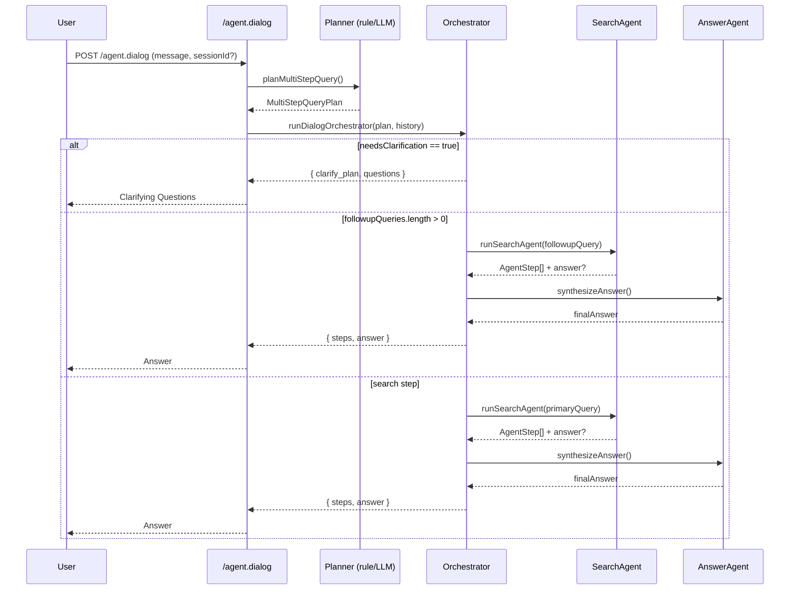

# Phase3: Multi-Step Query Planning & Dialog Orchestration

本ドキュメントは、Phase3 で追加する Multi-Step Planner と対話型 FAQ エージェントの設計メモです。

## 1. 目的

- ユーザーの曖昧な質問を Multi-Step で解決する FAQ エージェントを実装する。
- Clarifying Question（追加質問）、Missing Info Detection、Follow-up Query Generation を行う。
- 既存の `/agent.search`（単発検索）を壊さずに、対話型の `/agent.dialog` を追加する。
- 将来の CrewAI / LangGraph 等によるマルチエージェント制御に耐えられる設計にする。

## 2. 全体アーキテクチャ概要

### 2.1 レイヤー構成

- HTTP / API 層
  - 既存: `POST /agent.search`
  - 追加: `POST /agent.dialog`（対話 + Multi-Step）

- Agent / Orchestrator 層
  - Planner Agent
    - ユーザー入力 + 履歴 → MultiStepQueryPlan を生成
  - Search Agent
    - SearchStep / FollowupSearchStep を実行（既存 `runSearchAgent` を再利用）
  - Answer Agent
    - 検索結果 + 会話コンテキスト → 最終回答文を生成（既存 `synthesizeAnswer` ベース）
  - Dialog Orchestrator
    - Planner / Search / Answer を束ね、複数ターンの対話を制御
    - 将来、CrewAI Orchestrator に差し替え可能なポートとして設計

- Tools 層
  - 既存: `searchTool`, `rerankTool`, `synthesisTool`
  - 将来: `clarifyTool`（ユーザーへの追加質問など）

### 2.2 状態管理

- セッション単位で会話コンテキストを管理する。
  - MVP ではメモリ内ストア（`contextStore.ts`）を想定。
  - 将来 Redis 等に差し替え可能なインターフェイスにする。
- AgentStep ログは既存の構造を拡張し、Multi-Step / Dialog 用のトレースにも使う。

## 3. Multi-Step Query Planning

### 3.1 MultiStepQueryPlan

従来の QueryPlan を内包する形で、Multi-Step 版のプランを導入する。

- MultiStepQueryPlan
  - steps: PlanStep[]
  - needsClarification: boolean
  - clarifyingQuestions?: string[]
  - followupQueries?: string[]
  - confidence: 'low' | 'medium' | 'high'
  - language?: 'ja' | 'en' | 'other'
  - raw?: unknown（LLM 生 JSON などを保持）

- PlanStep（ユニオン）
  - ClarifyStep
    - type: 'clarify'
    - questions: string[]
  - SearchStep
    - type: 'search'
    - query: string
    - topK: number
    - filters?: { ... }
  - FollowupSearchStep
    - type: 'followup_search'
    - basedOn: 'user' | 'previous_answer'
    - query: string
  - AnswerStep
    - type: 'answer'
    - style: 'faq' | 'step_by_step'
    - includeSources: boolean

### 3.2 v1 実装方針

- v1 では「単一 SearchStep を含む MultiStepQueryPlan」を返すシンプル実装から始める。
  - ClarifyStep / FollowupSearchStep は型のみ定義し、ロジックは後続ステップで段階的に追加。
- 既存の `planQuery` / `planQueryWithLlmAsync` を再利用し、その結果を MultiStepQueryPlan にラップする。
- `planMultiStepQuery` という新しいエントリポイントを追加する。

### 3.3 LLM Planner との関係

- 既存のオプション `useLlmPlanner` を引き続き利用する。
  - false/未指定: Rule-based Planner
  - true: LLM ベースの Planner（将来、`planQueryWithLlmAsync` 内部を差し替え）

`planMultiStepQuery` 自体も `useLlmPlanner` を受け取り、単一 QueryPlan 部分の生成方法を切り替える。

### 3.4 LLM Multi-Step Planner（JSON スキーマ & プロンプト仕様）

Phase3 では、`useLlmPlanner: true` のときに LLM が Multi-Step Query Plan を生成できるようにする。  
このセクションでは、LLM が返す JSON 構造とプロンプト設計の仕様を定義する。

#### 3.4.1 LLM 出力 JSON 仕様（必須フィールド）

LLM は必ず以下の形式で JSON オブジェクトを返す：

```jsonc
{
  "steps": [
    {
      "id": "step_xxx",
      "type": "clarify" | "search" | "followup_search" | "answer",
      "description": "人間向けの短い説明",
      // type ごとの必須キー:
      // clarify:        questions: string[]
      // search:         query: string, topK?: number, filters?: object | null
      // followup_search: basedOn: "user" | "previous_answer", query: string, topK?: number
      // answer:         style?: "faq" | "step_by_step", includeSources?: boolean
    }
  ],
  "needsClarification": boolean,
  "clarifyingQuestions": string[]?,
  "followupQueries": string[]?,
  "confidence": "low" | "medium" | "high",
  "language": "ja" | "en" | "other"?
}
```

サーバ側ではこの JSON を `LlmMultiStepPlan` として受け取り、  
型変換したうえで `MultiStepQueryPlan` にマッピングする。

#### 3.4.2 LLM 用 System Prompt 指針

```
あなたは EC / コマース FAQ 検索の「プランナー」です。
ユーザーの質問と会話履歴をもとに、
Clarify / Search / Followup / Answer のステップを含む Multi-Step Plan を作成します。

制約:
- 出力は必ず JSON のみ。余計な文章やコードブロックマーカーは禁止。
- 上記 JSON 仕様に完全準拠すること。
- 曖昧な質問 → ClarifyStep を生成し needsClarification を true にする。
- 会話履歴がある場合、明らかにフォローアップなら followup_search を使う。
- answer ステップは FAQ の最終回答生成を表すステップ。
- language はユーザー入力の主要言語を推定して設定する。

各ステップの id は "step_search_1" のように一意の文字列とする。
```

#### 3.4.3 User Prompt テンプレート（Node 側が埋め込む）

```
以下はユーザーの最新の質問と、必要に応じて直近の会話履歴です。
FAQ 検索エージェントの実行プランを JSON で生成してください。

## 現在のユーザー質問
{currentQuestion}

## 会話履歴（新しい順）
{historyAsText}
```

`historyAsText` には以下のような形式で role:content を結合する：

```
assistant: 送料は地域と商品サイズにより異なります。通常は本州500円、北海道800円です。
user: 北海道への送料は？
```

#### 3.4.4 今後の拡張ポイント

- OpenAI / CrewAI / LangGraph など、LLM ランタイムの置換が可能。
- JSON パース不能・不完全な場合は Rule-based Planner にフォールバック。
- Clarify / Followup ロジックを LLM 主導に移行する際の仕様基盤として利用する。

## 4. Dialog Orchestrator と `/agent.dialog`

### 4.1 API イメージ

#### 4.1.1 /agent.dialog レスポンス例（Clarify / Search / Follow-up）

**Clarify（曖昧質問）ケース:**
```jsonc
{
  "sessionId": "sess-123",
  "answer": null,
  "needsClarification": true,
  "clarifyingQuestions": ["どの商品について知りたいですか？"],
  "steps": [],
  "final": false,
  "meta": {
    "orchestratorMode": "local",
    "multiStepPlan": { "needsClarification": true },
    "orchestrationSteps": [
      { "id": "step_clarify_1", "type": "clarify", "questions": ["どの商品について知りたいですか？"] },
      { "type": "clarify_plan", "questions": ["どの商品について知りたいですか？"] }
    ]
  }
}
```

**Search（通常検索）ケース:**
```jsonc
{
  "sessionId": "sess-123",
  "answer": "北海道への送料は800円です。",
  "needsClarification": false,
  "steps": [
    { "type": "search", "message": "検索を実行しました", "query": "北海道 送料", "topK": 3 }
  ],
  "final": true,
  "meta": {
    "orchestratorMode": "local",
    "orchestrationSteps": [
      { "id": "step_search_1", "type": "search", "query": "北海道 送料" },
      { "type": "search_executed", "query": "北海道 送料", "topK": 3, "source": "searchAgent" }
    ]
  }
}
```

**Follow-up（前ターンに基づく検索）ケース:**
```jsonc
{
  "sessionId": "sess-123",
  "answer": "返品ポリシーは商品到着後30日以内です。",
  "needsClarification": false,
  "steps": [
    { "type": "search", "message": "検索を実行しました", "query": "返品 ポリシー", "topK": 5 }
  ],
  "final": true,
  "meta": {
    "orchestratorMode": "local",
    "orchestrationSteps": [
      { "id": "step_search_1", "type": "search", "query": "送料" },
      { "type": "search_executed", "query": "返品 ポリシー", "topK": 5, "source": "searchAgent" }
    ]
  }
}
```

- Path: `POST /agent.dialog`
- Request:
  - sessionId?: string
  - message: string
  - history?: { role: 'user' | 'assistant' | 'system'; content: string }[]
  - options?:
    - topK?: number
    - language?: 'ja' | 'en' | 'auto'
    - useLlmPlanner?: boolean
    - useMultiStepPlanner?: boolean
    - mode?: 'local' | 'crew'
    - debug?: boolean

**リクエスト例:**

初回ターン（sessionId 未指定、シンプル検索）の例:
```jsonc
POST /agent.dialog
{
  "message": "北海道への送料を教えてください",
  "options": {
    "topK": 3,
    "language": "ja",
    "useMultiStepPlanner": true,
    "useLlmPlanner": false,
    "mode": "local"
  }
}
```

2ターン目以降（sessionId を指定してコンテキスト継続）の例:
```jsonc
POST /agent.dialog
{
  "sessionId": "sess-123",
  "message": "じゃあ返品ポリシーも知りたい",
  "options": {
    "topK": 5,
    "language": "ja",
    "useMultiStepPlanner": true,
    "useLlmPlanner": false,
    "mode": "local"
  }
}
```

LLM Planner + GPT-OSS 20B/120B ルーティング有効化の例:
```jsonc
POST /agent.dialog
{
  "message": "ギフト配送と領収書発行の条件をまとめて教えて",
  "options": {
    "topK": 8,
    "language": "ja",
    "useMultiStepPlanner": true,
    "useLlmPlanner": true,
    "mode": "local",
    "debug": true
  }
}
```

- Response:
  - sessionId: string
  - answer: string | null
  - needsClarification: boolean
  - clarifyingQuestions?: string[]
  - steps: AgentStep[]
  - final: boolean
  - meta?:
    - multiStepPlan?: MultiStepQueryPlan
    - orchestratorMode: 'local' | 'crew'
    - latencyMs?: number

#### 4.1.2 Planner / Orchestrator シーケンス図



### 4.2 Orchestrator モード

- local モード（デフォルト）
  - 全ての制御を Node.js 側で実装する。
  - CrewAI などは利用しない or 将来のために抽象を残す。
- crew モード（将来）
  - 別プロセス / サービス（Python CrewAI など）を呼び出す。
  - Node 側は `CrewOrchestratorClient` を通じて JSON ベースでやり取りする。

#### 4.2.1 crew モード API 契約（案）

`orchestratorMode: "crew"` のとき、Node 側は Crew Orchestrator サービス（例: Python CrewAI）に
JSON ベースで Plan 実行を委譲する。

- Node → Crew 側への Request 例:

```jsonc
POST /crew/orchestrator/plan
{
  "conversation": [
    { "role": "user", "content": "北海道への送料を教えてください" },
    { "role": "assistant", "content": "本州500円、北海道800円です。" },
    { "role": "user", "content": "ギフト配送と領収書発行の条件をまとめて教えて" }
  ],
  "locale": "ja",
  "planOptions": {
    "topK": 8,
    "language": "ja"
  },
  "routeContext": {
    "contextTokens": 1200,
    "recall": 0.7,
    "complexity": "medium",
    "safetyTag": "none"
  },
  "debug": true
}
```

- Crew 側からの Response 例（MultiStepQueryPlan にマッピング可能な形式）:

```jsonc
{
  "plan": {
    "steps": [
      {
        "id": "step_clarify_1",
        "type": "clarify",
        "questions": ["ギフト配送と領収書発行のどちらを優先して知りたいですか？"]
      },
      {
        "id": "step_search_1",
        "type": "search",
        "query": "ギフト配送 条件",
        "topK": 5
      },
      {
        "id": "step_search_2",
        "type": "search",
        "query": "領収書 発行 条件",
        "topK": 5
      },
      {
        "id": "step_answer_1",
        "type": "answer",
        "style": "faq",
        "includeSources": true
      }
    ],
    "needsClarification": true,
    "clarifyingQuestions": [
      "ギフト配送と領収書発行のどちらを優先して知りたいですか？"
    ],
    "followupQueries": [
      "ギフト配送 条件",
      "領収書 発行 条件"
    ],
    "confidence": "high",
    "language": "ja",
    "raw": {
      "llmRoute": "120b",
      "traceId": "crew-xyz-123"
    }
  }
}
```

Node 側では `plan` 部分を `MultiStepQueryPlan` にマッピングし、
`runDialogOrchestrator` の `plan` 引数として利用する。

> Phase3 では **crew モードはまだ実装しない**。  
> ここで定義した JSON 契約を Phase4 で CrewAI 実装に流用する。

## 5. ディレクトリ追加案（抜粋）

- `src/agent/dialog/`
  - `types.ts` … DialogTurn, MultiStepQueryPlan 型定義
  - `dialogAgent.ts` … `/agent.dialog` のエージェント実装
  - `contextStore.ts` … 会話コンテキスト管理（MVP: in-memory）
- `src/agent/flow/`
  - `multiStepPlanner.ts` … MultiStepQueryPlan 生成ロジック
- `src/agent/http/`
  - `agentDialogRoute.ts` … `/agent.dialog` エンドポイント
- `src/agent/orchestrator/crew/`（後続）
  - `crewClient.ts`
  - `crewSchemas.ts`

## 6. 今後の実装ステップ

1. `src/agent/dialog/types.ts` に Dialog / MultiStep 用の型を定義する。
2. `src/agent/flow/multiStepPlanner.ts` に v1 の Single-step ラッパー実装を追加する。
3. `src/agent/dialog/dialogAgent.ts` に Single-step 版対話エージェントを実装する（内部では `runSearchAgent` を呼び出す）。
4. `src/agent/http/agentDialogRoute.ts` に `/agent.dialog` の HTTP ルートを追加する。
5. その後、ClarifyStep / FollowupSearchStep のロジックとテストを段階的に追加していく。