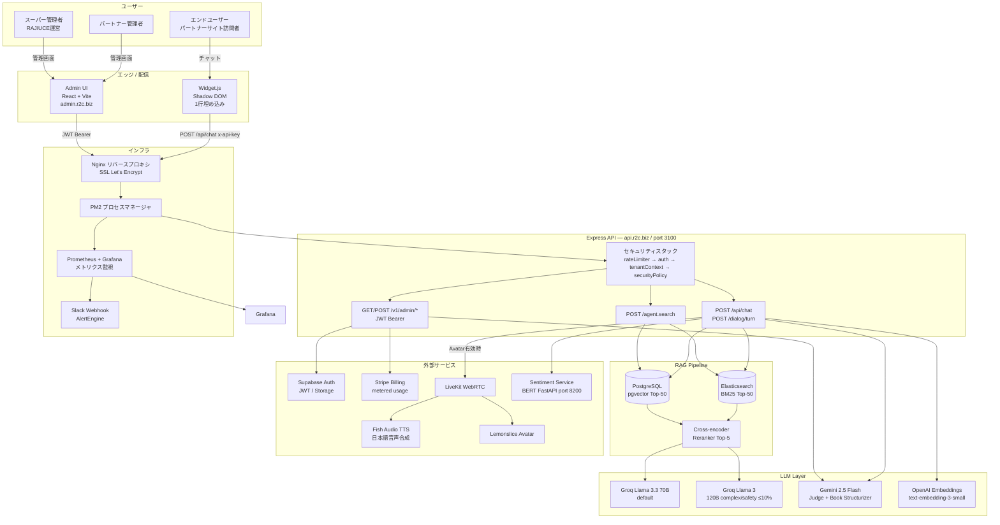
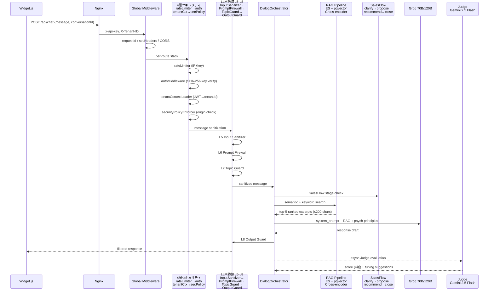
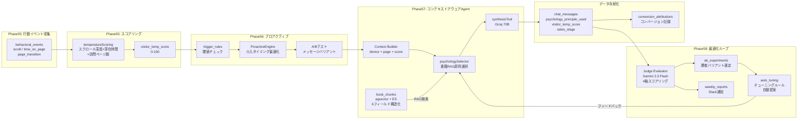

# RAJIUCE Architecture Diagrams

Mermaid記法で記述したアーキテクチャ図集。GitHubで直接レンダリング可能。

---

## 1. システム全体図（C4 Context）

---

## 2. チャットリクエストフロー（Sequence）

---

## 3. データフロー図（行動データ → コンバージョン最適化）

---

## 参照

- システム全体: [`ARCHITECTURE.md`](../ARCHITECTURE.md)
- セキュリティ: [`docs/auth.md`](auth.md)
- Phase詳細: [`PHASE_ROADMAP.md`](../PHASE_ROADMAP.md)
- 戦略ビジョン: [`docs/R2C_STRATEGIC_VISION.md`](R2C_STRATEGIC_VISION.md)
